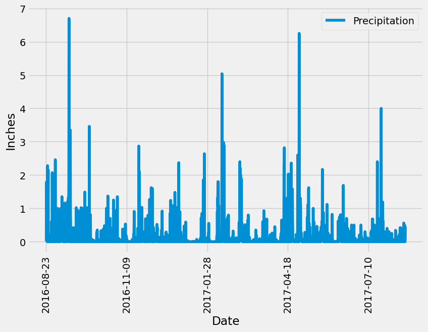
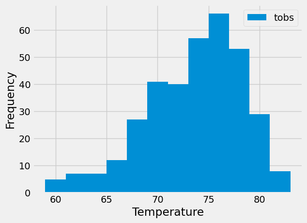

# SQLAlchemy Challenge: Surf's Up

This repository contains my work for the 10th challenge of the UofT SCS edX Data Bootcamp.

## Background

Congratulations! You've decided to treat yourself to a long holiday vacation in Honolulu, Hawaii. To help with your trip planning, you decide to do a climate analysis about the area. The following sections outline the steps that you need to take to accomplish this task.

## Summary

This challenge was completed in two parts: first, a precipitation and station analysis was completed in a Jupyter Notebook (climate_starter.ipynb); then, a Flask API was created with 6 routes to allow users to query some of the analysis data.

## Precipitation and Station Analysis

This first part of the challenge used Python, SQLAlchemy ORM queries, Pandas, and Matplotlib to analyze the climate data.

An exploratory analysis of precipitation was completed to plot the last 12 months of precipitation data:

An exploratory analysis of stations then yielded this histogram of observed temperatures and their frequency:

## Flask API

Based on the queries completed in the above analyses, a Flask API was created to allow users to navigate the queries. The following six routes were created:

1. Homepage allowing users to browse the available routes.
2. Precipitation route to show the last 12 months of daily precipitation data.
3. Stations route to show the names and IDs of the stations included in the analysis.
4. Tobs route to show the last 12 months of daily observed temperatures for the most active station.
5. Start route which allows a user to input a start date of their choice and view the minimum, average, and maximum daily temperatures from the chosen start date onward.
6. Start and end route which allows a user to input a start and end date of their choice to view the minimum, average, and maximum daily temperatures for that date range.

The Flask API can be run in the command line from the file app.py.

## References
Menne, M.J., I. Durre, R.S. Vose, B.E. Gleason, and T.G. Houston, 2012: An overview of the Global Historical Climatology Network-Daily Database. Journal of Atmospheric and Oceanic Technology, 29, 897-910, https://journals.ametsoc.org/view/journals/atot/29/7/jtech-d-11-00103_1.xmlLinks to an external site.